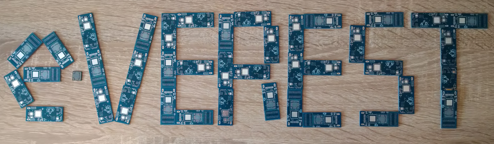
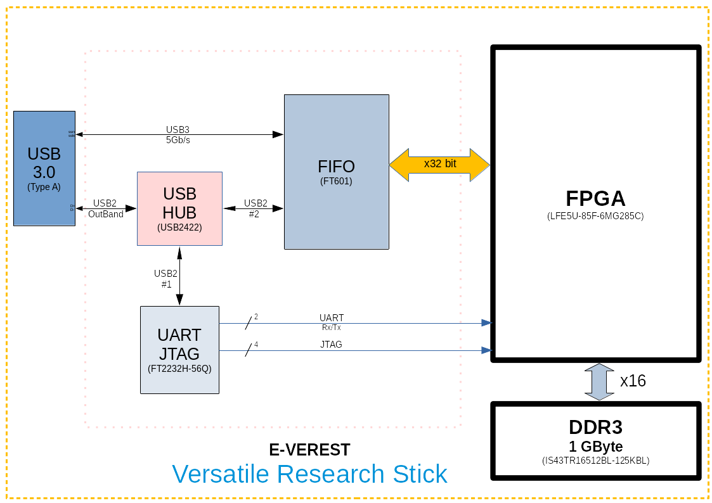
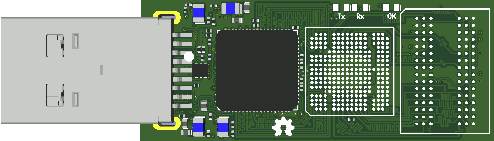
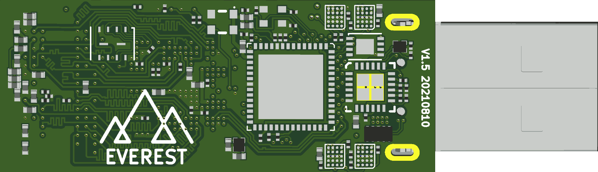
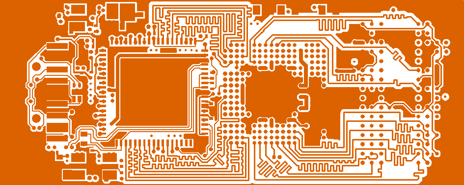
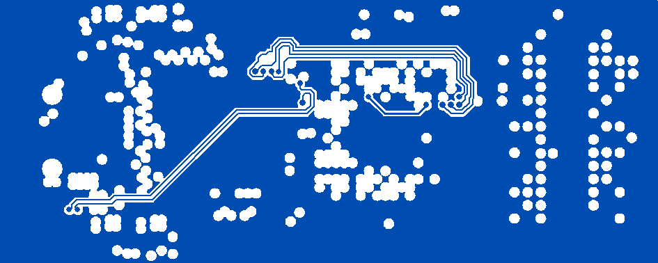
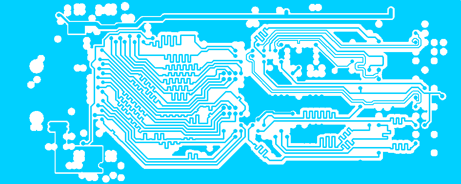
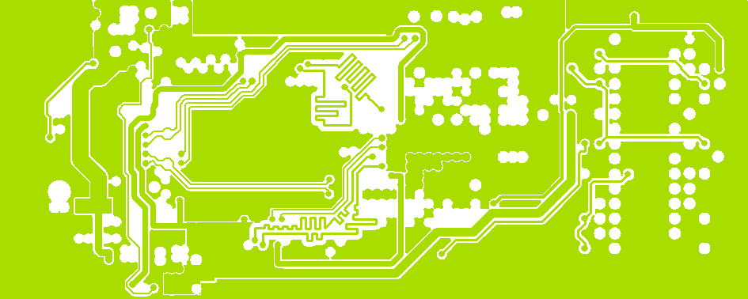
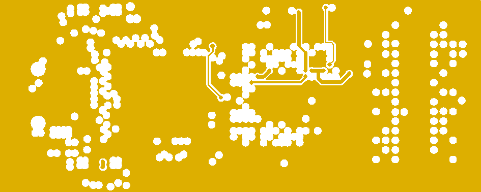
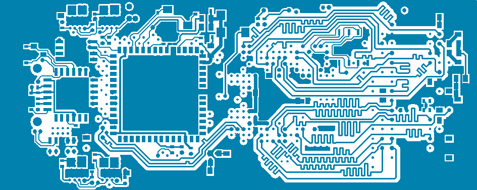

# e-verest
**e**-**Ve**rsatile **Re**search **St**ick for peoples



## Description

  With the rising of high quality opensource tools for FPGAs new opportunities are emerging to discover and build better digital architectures.
  This stick is intended as lowest cost tool for anyone who desire to explore & research the world of modern digital systems.
  It can be used to develop, test and benchmark fairly large digital designs, straight using a complete opensource toolchain end to end.

  It can close the gap between emerging trend of high level generated systems (automatic reinforced exploration of arhitectures) and the lack of end to end toolchain harvesting a real FPGA for final feedback.

  Let Here Be Dragons ! (Yetis are also welcome).


## Specs:

* Small size **16x40mm** usb stick
* Generous **85k LUT** **FPGA** logic space
* Holds **1Gbyte DDR3** memory with **x16** wide access
* USB3 **5Gbps/s** data access over **x32** wide independent FIFO
* USB2 outband (same usb port) permanent **JTAG** and **UART** independent access
* Full opensource HDL flow usig [YoSYS](https://github.com/YosysHQ) suite

Can be used in any USB port right from the tips of fingers, no cables, no wires but full control.




## Progress:
* ```23-Apr-2020``` A batch of 50 PCB arrived. Thank you [WellPCB PTY LTD](https://www.wellpcb.com) !
* ```20-Dec-2020``` Second iteraton of PCB has been done, schematics and pcb design are updated.
* ```20-Jan-2021``` Announcing [OLIMP](https://github.com/cbalint13/OLIMP) having e-VEREST as demo board.
* ```17-Aug-2021``` Third iteration of PCB has been done, design is updated.


## Project files
* See the [design files](hardware) available for Altium ®, CircuitMaker ®, KiCAD and Gerber format.
* Check [schematic](hardware/e-VEREST-v1_5.pdf) available as quick readable format.
* There is also an CircuitMaker ® [online version](https://circuitmaker.com/Projects/Details/Cristian-Balint/e-VEREST) available.
* Software tools for managing the stick and examples coming soon (WiP)
* There are plans for making batch of units via CrowdSupply campains (WiP).

## PCB views

| Layer       | Polygons Description |Image  |
| ----------- | ------------------- |-------|
| Top | Signal Layer | |
| Inner 1 | GND Plane | |
| Inner 2 | Signal Layer | |
| Inner 3 | Power Plane | |
| Inner 4 | GND Plane | |
| Bottom |  Signal Layer | |
